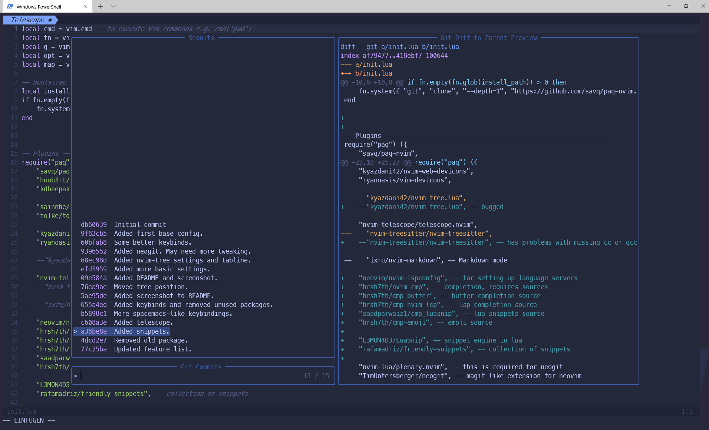

# README neovim-lua

This is my repository for my Neovim configuration. It is currently separated
from my usual dotfiles, so that I can experiment with some settings and also
because I mostly use Neovim in a Windows enviroment, where the folder is
currently separately anyway.

I typically use Neovim from within PowerShell inside Windows Terminal.

## Current features

* Tabline
* Statusline via Lualine
* Themes: everfortest and tokyonight
* devicon support
* LSP basic config for python (pyright)
* Completion via vim-cmp
* Snippets via luasnip and snippet colletion
* Neogit
* Org-Mode

